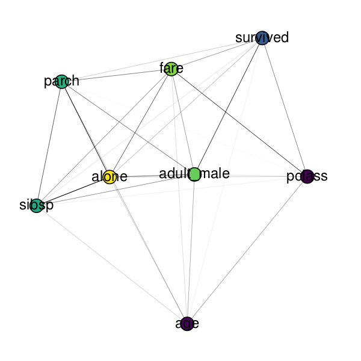

# corregraphe

Correlation graphs are a great way to visualize and understand the relationship between features of tabular datasets.

This package leverages NetworkX, Scipy and HoloViews to easily draw correlation graphs on any Pandas DataFrame.

## Installation

Coming soon

## Usage

Example on the Titanic dataset:

```python
import pandas as pd
from corregraphe import CorrelationGraph
df = pd.read_csv("https://raw.githubusercontent.com/mwaskom/seaborn-data/master/titanic.csv")
cg = CorrelationGraph(df)
cg.draw()
```

Drawing gives this Bokeh figure:



## Developer's guide

- checked with `mypy` and `flake8`
- formatted with `black` and `isort`
- basic functionality is tested with `doctest` by running `python corregraphe/core.py`

## License

This project is licensed under the MIT License.
